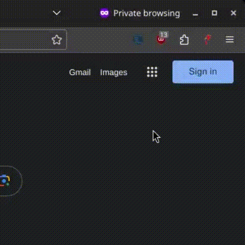

# Lexilogos Arabic Transcriber Browser Extension
 

## Description

This browser extension streamlines Arabic writing by converting Latin letters to Arabic using the [**lexilogos.com**](https://www.lexilogos.com/clavier/araby.htm) method, significantly enhancing speed and practicality.

## Preview

## Installation

### Chromium-based Browsers (e.g., Google Chrome, Microsoft Edge)

1. [**Download**](https://codeload.github.com/AhmedSahbaoui69/LexilogosArTranscriberXT/zip/refs/heads/main) the latest release.
2. **Unzip the file.**
3. Open your browser and go to the Extensions page (`chrome://extensions/` for Chrome/Edge).
4. Enable "Developer mode."
5. Click on "Load unpacked" and select the unzipped extension folder.

### Firefox

1. [**Download**](https://codeload.github.com/AhmedSahbaoui69/LexilogosArTranscriberXT/zip/refs/heads/main) the latest release.
2. **Unzip the file.**
3. Open your Firefox browser.
4. Go to the Add-ons page (`about:addons`).
5. Click on the gear icon and select "Debug Add-ons."
6. Click on "Load Temporary Add-on" and select any file from the unzipped extension folder.

## How to Use

1. **Click on the extension's icon in your browser.**
2. **Witness the magic of instant transcription!**

## License

This project is licensed under the [MIT License](LICENSE).
